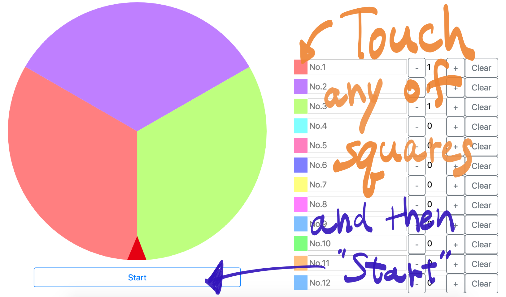

# Unfair Roulette

This is truely fair roulette usually.  
But if you expect, you can do cheat!

[Application Page](https://hahnah.github.io/unfair-roulette/)

## How to cheat at the roulette



## How to Build

### Development

#### Requirements

- [Node.js](https://nodejs.org/)
- [Volta](https://volta.sh/)

And install dependencies with bellow command.

```bash
npm install
```

#### Run on Dev Server

```bash
npm run build
```

### Production Build

```bash
npm run build
```

## Author

Hahnah (Natsuki Harai)

- WebSite: [Hahnah Chronicle](https://hahnah.github.io)
- X: [@superhahnah](https://twitter.com/superhahnah)

## License

MIT © [Hahnah](https://superhahnah.com)
